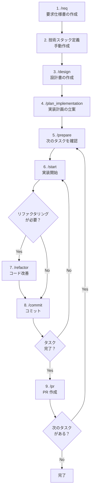

# AI Coding Template

AI Agent との協働開発（Pair Programming with AI）を前提に設計された、高品質なプロジェクトテンプレートです。
セキュリティ、品質管理、そして AI とのコラボレーションを円滑にするためのワークフローがあらかじめ組み込まれています。

## 特徴 (Features)

*   **🛡️ セキュリティ & 品質管理**:
    *   [Lefthook](https://github.com/evilmartians/lefthook) による Git Hooks 管理。
    *   [Gitleaks](https://github.com/gitleaks/gitleaks) によるシークレットスキャン。
    *   [OSV-Scanner](https://github.com/google/osv-scanner) による脆弱性スキャン。
*   **🤖 AI Agent Workflows**:
    *   AI コーディングアシスタント（Antigravity, Cursor）向けに最適化されたワークフロー定義 (`.agent/workflows/`)。
    *   定型タスク（コミット、リファクタリング、設計、実装計画など）をスラッシュコマンドで実行可能。
*   **📝 ドキュメント標準**:
    *   開発の指針となる [CONTRIBUTING.md](./CONTRIBUTING.md) を完備。
    *   ISO/IEC/IEEE 29148:2018 に準拠した要求仕様策定フローをサポート。

## 始め方 (Getting Started)

### 前提条件 (Prerequisites)

*   Git
*   [Lefthook](https://github.com/evilmartians/lefthook)
*   [Gitleaks](https://github.com/gitleaks/gitleaks)
*   [OSV-Scanner](https://github.com/google/osv-scanner)

### セットアップ (Setup)

このテンプレートを使用してリポジトリを作成したら、以下のコマンドで Git Hooks を初期化してください。

```bash
# Install specific tools (macOS example)
brew install lefthook gitleaks osv-scanner

# Initialize Lefthook
lefthook install
```

## 使い方 (Usage)

### AI Agent との協働

このリポジトリには、AI Agent に指示を出すための「ワークフロー」が定義されています。
対応する AI エディタやエージェント（Cursor, Antigravity など）を使用している場合、以下のスラッシュコマンドでタスクを効率化できます。

### 利用可能なコマンド一覧

| コマンド | 説明 |
|---------|------|
| `/req` | ISO/IEC/IEEE 29148:2018 形式の要求仕様書 (`docs/requirements.md`) を作成 |
| `/design` | 要求仕様に基づいた基本設計書 (`docs/design.md`) を作成 |
| `/plan_implementation` | GitHub Issue 単位の実装計画 (`docs/implementation_plan.md`) を立案 |
| `/prepare` | 実装計画から次に着手すべきタスクを特定し、実装ガイドを提示 |
| `/start` | 指定されたタスクの TDD サイクルに基づく実装を開始 |
| `/refactor` | 振る舞いを変えずにコードの内部構造を改善 |
| `/commit` | 変更内容を解析し Conventional Commits 形式でコミット |
| `/pr` | GitHub プルリクエストを作成 |

### 一般的な開発フロー

以下は、新規プロジェクトを AI Agent と協働で進める際の推奨フローです。



#### 各フェーズの詳細

**Phase 1: 要件定義 & 設計**

1.  **`/req`**: 作りたいものの概要を伝えると、ISO/IEC/IEEE 29148 に準拠した要求仕様書のドラフトを自動生成します。
2.  **技術スタック定義（手動）**: `docs/tech_stack.md` を作成し、使用する言語・フレームワーク・ライブラリを定義します。
    *   ⚠️ **このステップは自動化されていません。ユーザー自身で作成してください。**
    *   AI Agent に相談しながら技術選定を行うことも可能です。
    *   記載例: 言語、フレームワーク、データベース、インフラ、主要ライブラリなど
3.  **`/design`**: 要求仕様と技術スタック (`docs/tech_stack.md`) に基づき、アーキテクチャ概要やモジュール設計を含む設計書を作成します。
4.  **`/plan_implementation`**: 設計書から GitHub Issue として登録可能な粒度でタスクを分解し、MVP ファーストの実装計画を立案します。

**Phase 2: 実装**

5.  **`/prepare`**: 実装計画 (`docs/implementation_plan.md`) を分析し、依存関係を考慮した上で次に着手すべきタスクを提示します。
6.  **`/start`**: Issue に対応するブランチを作成し、TDD サイクル（Red → Green → Refactor）に従って実装を進めます。
7.  **`/refactor`**: 必要に応じて、テストを壊さない範囲でコードを改善します。

**Phase 3: コミット & PR**

8.  **`/commit`**: 変更内容を自動解析し、Conventional Commits 形式のコミットメッセージを生成してコミットします。
9.  **`/pr`**: PR テンプレートに従ってプルリクエストを作成します。

### 既存プロジェクトでの利用

既存のプロジェクトに途中から適用する場合も、以下のコマンドは単体で利用できます。

*   **`/commit`**: 日常的なコミット作業の効率化に
*   **`/refactor`**: コードベースの段階的な改善に
*   **`/pr`**: PR 作成作業の自動化に

## ライセンス (License)

[MIT License](./LICENSE)
